#Android动态模糊实现的研究
#####作者 yuxfzju

## 一 预备知识
### 1.1 什么是模糊
Android开发中的模糊主要是指对图像（或者Bitmap）的模糊。模糊效果实际上是一种特定的图像退化过程，给人一种分辨不清的视觉效果。这种视觉效果实际上是由于图像的相邻像素具有相同或相似的像素特征引起的。因此模糊图像实际上是原高分辨率图像的像素信息与相邻像素信息混合叠加的结果。

### 1.2 模糊核
那么该用怎么样的方式进行像素的混合叠加？这里引入模糊核（Blur Kernel）的概念，模糊核的作用可以理解为一种Filter，表示当前像素与周围像素点之间的加权关系。如下是一个核半径为1的模糊核。模糊核大小和半径关系为 
```
size = 2 * radius + 1
```。


|a|b|c|
|---|---|---|
|d|e|f|
|g|h|i|

将模糊效果作用于图像之上，数学上可看作图像与模糊核进行卷积（Convolution）运算, 如下，* 为卷积运算。


>详细的卷积运算介绍可以点[这里](https://en.wikipedia.org/wiki/Convolution)。

可以看到，模糊处理后的像素值（这里是[2,2]）为当前像素点与周围相邻像素点的加权和。因此，图像的模糊效果，不仅和模糊核的半径有关，和模糊核的权重值分布也有很大关系。而根据模糊核分布方式的不同，Android的模糊方式可以分为```均值模糊、高斯模糊以及Stack模糊```。

### 1.3 均值模糊
均值模糊（Box Blur）顾名思义，即模糊图像的每一个像素为周围相邻像素的平均取值。因此半径为1的均值模糊核可以表示为：

|1/9|1/9|1/9|
|---|---|---|
|1/9|1/9|1/9|
|1/9|1/9|1/9|

由于均值模糊的权重值相同，因此算法相对于其他类型的模糊算法，具有更少的计算量，但模糊效果相对差一些。

### 1.4 高斯模糊
高斯模糊（Gaussian Blur）的模糊核产生方式相对复杂一些，称为高斯模糊是由于利用高斯函数计算权重值。

对于一维模糊核，权重值计算公式为：


二维模糊核，权重值计算公式为：

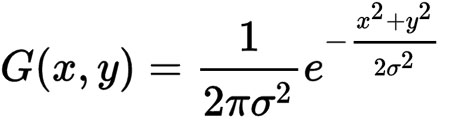

其中中心像素坐标为（0,0），因此σ=1.5，半径为1的高斯模糊核为

|0.0453542|0.0566406|0.0453542|
|---|---|---|
|0.0566406|0.0707355|0.0566406|
|0.0453542|0.0566406|0.0453542|

归一化之后为：

|0.0947416|0.118318|0.0947416|
|---|---|---|
|0.118318|0.147761|0.118318|
|0.0947416|0.118318|0.0947416|

### 1.5 Stack模糊
Stack Blur是对高斯模糊的一种近似，与均值模糊相比具有更好的模糊效果，与高斯模糊相比具有更高效的算法效率。Stack模糊在模糊核权重的生成方式上更简单一些，每个相邻像素权重值与其中心像素间距离相关。
对于半径为r的一维模糊核，模糊核可以表示为：

|1|2|...|r|r+1|r|...|2|1|
|---|---|---|---|---|---|---|---|---|

以半径为1的模糊核为例：
一维模糊核为：

|1|2|1|
|---|---|---|
归一化为：

|1/4|2/4|1/4|
|---|---|---|

对于二维模糊核，模糊图像可以当做横向模糊，再纵向模糊处理的结果，因此可以逐步表示为:

|1|2|1|
|---|---|---|
|1|2|1|
|1|2|1|
应用纵向模糊后为:

|1|2|1|
|---|---|---|
|2|4|2|
|1|2|1|
归一化后为：

|1/16|2/16|1/16|
|---|---|---|
|2/16|4/16|2/16|
|1/16|2/16|1/16|

由于权重值不再需要额外计算，因此相比于高斯模糊，Stack模糊更高效一些，同时该算法并不是简单的取平均值，因此模糊效果会比均值模糊更好一些。

### 1.6 模糊效果示例
下面是不同模糊核取值下的模糊结果。可以看到均值模糊效果比较一般，在图像的边缘处会出现重影。而高斯模糊和Stack模糊之间相差不大。

- Box Blur


- Stack Blur


- Gaussian Blur

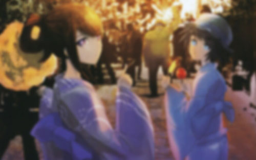


## 二 模糊的实现方案

### 2.1 分步模糊
为获得较好的模糊算法效率，一般不直接采用二维模糊核对图像进行处理，而是采用分步的方式，将模糊过程分为水平方向和垂直方向依次处理，因此每次模糊只需要一维模糊核即可。对于模糊核半径为r下，采用二维模糊核的复杂度为O(n * r <sup>2</sup>)，而分步模糊的方式可以将复杂度减少至O(n * r)，当模糊核半径提高时，分步模糊的优势将逐渐明显。


下面是分步模糊的最终结果

- 横向模糊和纵向模糊

 

- 双向模糊


模糊的实现方案有很多，这里主要选择如下方案实现。

- Java
- Native（C/C++）
- RenderScript
- OpenGL

下面分别对这些方案进行说明。

### 2.2 Java和Native C/C++方案
Java和Native的方案实际并无较大的区别，Native方案的优势在于采用jni的方式调用模糊算法，相比于Java的方式，模糊的效率能得到进一步的提升。算法还对像素值计算进行了优化。

#### 滑动窗口算法

在模糊核依次应用到每个像素点上时，可以将模糊看作一个滑动窗口。


可以看到，每当窗口移动到下一个像素点时，部分像素仍在窗口内，
对于Box Blur实际并不需要重新计算窗口内所有元素的总和，只需要考虑移出窗口和进入窗口两个元素即可，也就是 ```sum += d - a;```，这里利用了模糊核权重值相同的特点。
对于Stack Blur则需要考虑权重值，虽然每个元素权重值不同，但根据前面的分析，相邻元素权重值差1，因此可以这样计算

```java
outsum = a + b;
insum = c + d;
sum += insum - outsum;

```
上面outsum和insum同样可以用滑动窗口方式计算。

实际代码如下：

- Box Blur


```java
for (int x = 0; x < width; x++) { // 滑动窗口的方式运算.
	out[outIndex] = (divide[ta] << 24) | (divide[tr] << 16) | (divide[tg] << 8) | divide[tb];
	
	int i1 = x + radius + 1;
	if (i1 > widthMinus1)
	    i1 = widthMinus1;
	int i2 = x - radius;
	if (i2 < 0)
	    i2 = 0;
	int rgb1 = in[inIndex + i1]; //进入窗口的像素
	int rgb2 = in[inIndex + i2]; //移出窗口的像素
	
	ta += ((rgb1 >> 24) & 0xff) - ((rgb2 >> 24) & 0xff);
	tr += ((rgb1 & 0xff0000) - (rgb2 & 0xff0000)) >> 16;
	tg += ((rgb1 & 0xff00) - (rgb2 & 0xff00)) >> 8;
	tb += (rgb1 & 0xff) - (rgb2 & 0xff);
	outIndex += height;
}
```

- Stack Blur

```java
 for (x = 0; x < w; x++) {

    r[yi] = dv[rsum];
    g[yi] = dv[gsum];
    b[yi] = dv[bsum];

    rsum -= routsum;
    gsum -= goutsum;
    bsum -= boutsum;

    stackstart = stackpointer - radius + div;
    sir = stack[stackstart % div];

    routsum -= sir[0];
    goutsum -= sir[1];
    boutsum -= sir[2];

    if (y == 0) {
        vmin[x] = Math.min(x + radius + 1, wm);
    }
    p = pix[yw + vmin[x]];

    sir[0] = (p & 0xff0000) >> 16;
    sir[1] = (p & 0x00ff00) >> 8;
    sir[2] = (p & 0x0000ff);

    rinsum += sir[0];
    ginsum += sir[1];
    binsum += sir[2];

    rsum += rinsum;
    gsum += ginsum;
    bsum += binsum;

    stackpointer = (stackpointer + 1) % div;
    sir = stack[(stackpointer) % div];

    routsum += sir[0];
    goutsum += sir[1];
    boutsum += sir[2];

    rinsum -= sir[0];
    ginsum -= sir[1];
    binsum -= sir[2];

    yi++;
}
```

但对于Gaussian Blur，由于权重值取值没什么规律，因此只能老老实实计算窗口中的所有元素。

- Gaussian Blur

```java
for (int col = -cols2; col <= cols2; col++) {
    float f = kernel[moffset + col];

    if (f != 0) {
        int ix = x + col;
        if (ix < 0) {
            ix = 0;
        } else if (ix >= width) {
            ix = width - 1;
        }
        int rgb = inPixels[ioffset + ix];
        r += f * ((rgb >> 16) & 0xff);
        g += f * ((rgb >> 8) & 0xff);
        b += f * (rgb & 0xff);
    }
}
```
#### 建立查询表
建立查询表指的是在模糊之前，提前计算好所有可能出现的取值。当模糊核确定时，模糊核的权重值总和是固定的，考虑所有可能出现的加权和值，并事先除以权重值总和，这样在每次加权平均的时候，不再需要做除法运算，只需要根据加权值进行查询即可获得最后的模糊结果。

```java
int tableSize = 2 * radius + 1;
int divide[] = new int[256 * tableSize];

// 建立 0 到 255的查询表, 0~256*tableSize 所有窗内元素权重和值的范围
for (int i = 0; i < 256 * tableSize; i++) {
    divide[i] = i / tableSize;
}
...

//不再需要除法，获得和值后，直接查表得到结果          
out[outIndex] = (divide[suma] << 24) | (divide[sumr] << 16) | (divide[sumg] << 8) | divide[sumb];
```

上述计算方式，高斯模糊无法实现，因此使用Java和Native实现的高斯模糊相对效率低一些。


### 2.4 RenderScript方案
Renderscript是Android系统上专门用于密集型计算的高性能框架。它基于异构计算思想（指使用不同类型指令集和体系架构的计算单元组成系统的计算方式），主要面向并行计算，并允许开发者以较少的代码实现功能复杂且性能优越的应用程序。RenderScript可在设备上所有可用的处理器上并行执行，例如多核CPU、GPU，所以开发者可以专心写处理算法，而不需要关心调度和负载平衡的问题。

RenderScript的方案不再需要考虑滑动窗口之类的情况，只需要根据当前坐标（x,y)获取相邻像素值。在RenderScript的Kernel代码中，```rsGetElementAt_uchar4()```和```rsSetElementAt_uchar4()```分别获取和设置像素值。

- Box Blur

BoxblurHorizontal.rs

```c
void __attribute__((kernel)) boxblur_h(uchar4 in, uint32_t x, uint32_t y) {

    float4 sum = 0;
    uchar4 result;
    int count = 0;
    int kernel = (2 * radius + 1);

    uchar4 center = rsGetElementAt_uchar4(input, x, y);

    for (int j = -radius; j <= radius; j++) {
        if (x >= 0 && x < width && y + j >= 0 && y + j < height) {
            uchar4 temp = rsGetElementAt_uchar4(input, x, y + j);
            sum += rsUnpackColor8888(temp);
            count++;
        }
    }


    sum = sum / count;
    result = rsPackColorTo8888(sum);
    result.a = center.a;
    rsSetElementAt_uchar4(output, result, x, y);

}
```
- Stack Blur

与Box Blur相似，只是需要考虑模糊核的权重值。

Stackblur.rs

```c
void __attribute__((kernel)) stackblur_h(uchar4 in, uint32_t x, uint32_t y) {

    float4 sum = 0;
    uchar4 result;
    int count = 0;
    int kernel = (2 * radius + 1);
    int weightSum = 0;

    uchar4 center = rsGetElementAt_uchar4(input, x, y);

    for (int i = -radius; i <= radius; i++) {
        if (x + i >= 0 && x + i < width) {
            uchar4 temp = rsGetElementAt_uchar4(input, x + i, y);
            int weight = radius + 1 - abs(i); //设置权重值
            sum += rsUnpackColor8888(temp) * weight;
            weightSum += weight;
        }

    }

    sum = sum / weightSum;
    result = rsPackColorTo8888(sum);
    result.a = center.a;
    rsSetElementAt_uchar4(output, result, x, y);

}
```
- Gaussian Blur

Android自带高斯模糊的实现方案，可以使用ScriptIntrinsicBlur调用底层接口。

```java
mGaussianBlurScirpt = ScriptIntrinsicBlur.create(mRenderScript, Element.U8_4(mRenderScript));
mGaussianBlurScirpt.setRadius(mRadius);
mGaussianBlurScirpt.setInput(mAllocationIn);
mGaussianBlurScirpt.forEach(mAllocationOut);
```

相比于Java和Native方案，RenderScript计算效率更高效，而使用android.support.v8.renderscript 的API，可以允许Android 2.3 (API level 9) 以上的系统运行RenderScript。

>关于RenderScript的介绍，详情请参考[官方文档](https://developer.android.com/guide/topics/renderscript/compute.html)。

### 2.5 OpenGL方案
### 屏上渲染还是离屏渲染
OpenGL的渲染方式可以分为屏上渲染和离屏渲染。Android中OpenGL的屏上渲染常使用GLSurfaceView和TextureView实现。

GLSurfaceView是SurfaceView的一种扩展，它加入了EGL的管理，同时GLSurfaceView也拥有SurfaceView的特性，它自带一个Surface，而这个Surface的渲染可以放到单独线程去做，渲染时可以有自己的GL context。直接使用GLSurfaceView的好处在于，Surface以及GL Context都在SurfaceView内部实现，不再需要额外操作。而缺点则在于一些View中的特性无法使用，包括平移，缩放等变换，显示也不受View的属性控制。TextureView则在此基础之上解决了这个缺点，但TextureView必须在硬件加速的窗口中。

离屏渲染同样需要EGL的管理，但从EGLSurface，EGLDisplay和EGLContext的创建和设置，都需要程序自行实现。

由于本文的目标在于直接获得模糊后的Bitmap，这选择离屏渲染的方式。当然也可以采用屏上渲染，但必须创建GLSurfaceView或TextureView，本身会消耗一定的系统资源。

### 实现流程
OpenGL的实现方案可以总结为：

1. 初始化EGL相关设置，包括EGLSurface，EGLDisplay，EGLContext的配置。如下面```EGL10.EGL_SURFACE_TYPE, EGL10.EGL_PBUFFER_BIT```即设置为离屏渲染；

	```glsl
	 int []configAttribs = {
	    EGL10.EGL_BUFFER_SIZE, 32,
	    EGL10.EGL_ALPHA_SIZE, 8,
	    EGL10.EGL_BLUE_SIZE, 8,
	    EGL10.EGL_GREEN_SIZE, 8,
	    EGL10.EGL_RED_SIZE, 8,
	    EGL10.EGL_RENDERABLE_TYPE, EGL_OPENGL_ES2_BIT,
	    EGL10.EGL_SURFACE_TYPE, EGL10.EGL_PBUFFER_BIT,
	    EGL10.EGL_NONE
	};
	
	int []numConfigs = new int[1];
	
	mEgl.eglChooseConfig(mEGLDisplay, configAttribs, mEglConfigs, 1, numConfigs);
	```

2. 初始化shader，根据模糊类型以及模糊核半径设置shader，shader实际控制了渲染方式，因此模糊是在Fragment shader当中处理的；
3. 根据原图获得原始纹理；
4. 利用不同shader分别进行水平和垂直方向的纹理渲染；
5. 调用GLES20.glReadPixels()提取纹理像素；
6. 反初始化EGL。

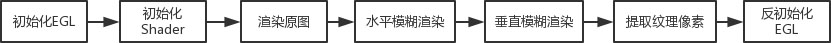

OpenGL的模糊过程如下，其中使用了FrameBufferObject实现离屏渲染：

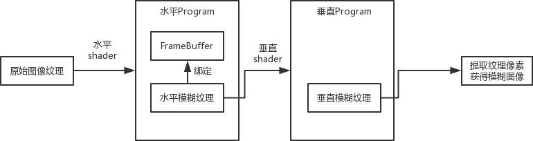


1. 首先获得原始图像纹理，

	```glsl
	mInputTexture = loadTexture(mBitmap);
	
	```
2. 由于对图像的操作分为水平和垂直模糊两步，因此在渲染时，也采用了水平和垂直Program。对于第一个Program，会将水平模糊纹理作为纹理附件与一个FrameBuffer绑定，

	```glsl
	mHorizontalProgram = GLES20.glCreateProgram();
	GLES20.glAttachShader(mHorizontalProgram, mVertexShader);
	GLES20.glAttachShader(mHorizontalProgram, mFragmentShader);
	GLES20.glLinkProgram(mHorizontalProgram);
	mHorizontalTexture = loadTexture(mWidth, mHeight);
	mHorizontalFrameBuffer = genFrameBuffer(mHorizontalTexture);
	
	```

3. 原始图像纹理(mInputTexture)经过shader的渲染时，模糊后的图像结果渲染到水平模糊纹理上，

	```glsl
	mTextureUniformHandle = GLES20.glGetUniformLocation(mHorizontalProgram, "uTexture");
	GLES20.glActiveTexture(GLES20.GL_TEXTURE0);
	GLES20.glBindTexture(GLES20.GL_TEXTURE_2D, mInputTexture);
	GLES20.glUniform1i(mTextureUniformHandle, 0);
	...
	GLES20.glDrawElements(GLES20.GL_TRIANGLES, drawOrder.length, GLES20.GL_UNSIGNED_SHORT, mDrawListBuffer);
	
	```

4. 然后利用该水平模糊纹理(mHorizontalTexture)作为输入纹理，再做一次渲染，得到最后的模糊图像。
	
	```glsl
	mTextureUniformHandle = GLES20.glGetUniformLocation(mVerticalProgram, "uTexture");
	GLES20.glActiveTexture(GLES20.GL_TEXTURE0);
	GLES20.glBindTexture(GLES20.GL_TEXTURE_2D, mHorizontalTexture);
	GLES20.glUniform1i(mTextureUniformHandle, 0);
	...
	GLES20.glDrawElements(GLES20.GL_TRIANGLES, drawOrder.length, GLES20.GL_UNSIGNED_SHORT, mDrawListBuffer);
	
	```
	
### 2.6 高斯模糊的参数选择
在高斯模糊当中，影响模糊效果的除了半径外，还有方差σ。在本文介绍的所有高斯模糊方案中，标准差```σ = (radius + 1) / 2```。这是由于固定取值的σ，随着模糊半径增加到一定值时，亲测会出现模糊效果不再改变的情况，继续增加半径不再有效。这里不再贴图，大家可以自测试试。


## 三 毛玻璃效果的实现
Android开发中的模糊需求主要是产生毛玻璃效果。毛玻璃效果实际上是对原图片的严重劣化，突出的就是朦胧感。毛玻璃效果与单纯的模糊图像不同的是，在模糊图像之前会对会对原图resize。Resize操作一般使用缩放因子（Sample Factor）衡量，缩放因子为s时的毛玻璃处理为：

	原图-->缩放尺寸到原来1/s的缩放图-->模糊处理-->恢复到原图尺寸


再优秀的模糊方案，当图片尺寸较大，且模糊核半径较大时，仍然会有性能上的问题。尺寸的缩小可大幅提高提高模糊的效率，实际缩放因子为5时，已能获得较好的毛玻璃效果和计算效率。


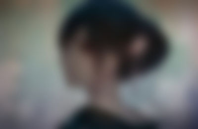

左图为无缩放的模糊图，右图缩放因子为8的模糊图，两图模糊半径10.

## 四 性能对比与分析


> 测试机型：小米note

### 4.1 模糊尺寸的影响
模糊1669×1080图片**10**次耗时对比,模糊核半径10

- 缩放因子2，模糊核半径10

|   |Java|Native|RenderScript|OpenGL|
|---|:---:|:---:|:---:|:---:|
|Box Blur| 1226ms |880ms|765ms|2730ms
|Stack Blur|2690ms|1484ms|810ms|2780ms|
|Gaussian Blur|6747ms|3204ms|569ms|2686ms


- 缩放因子10，模糊核半径10

|   |Java|Native|RenderScript|OpenGL|
|---|:---:|:---:|:---:|:---:|
|Box Blur| 325ms | 298ms |277ms|545ms
|Stack Blur|393ms| 356ms |294ms|516ms|
|Gaussian Blur|762ms|428ms| 272ms | 568ms

可以看到，当原图尺寸较大的情况下，模糊只能达到30帧的效果。影响模糊耗时有几个因素

- 在获得模糊图像后，需要将图像尺寸回复至原图尺寸，这一步实际较为耗时；
- OpenGL方案之所以性能稍差，是因为从纹理提取像素的操作，```GlES20.glReadPixels()```是一个相当耗时的操作。
- 原图尺寸本身较大，分辨率较高。

但实际应用模糊效果时，实际需要的Bitmap尺寸要小一些。对于1000×600的图像，则能达到60帧。

- 模糊1000×600图片**10**次耗时对比，缩放因子10，模糊核半径10

|   |Java|Native|RenderScript|OpenGL|
|---|:---:|:---:|:---:|:---:|
|Box Blur| 183ms | 172ms |178ms|278ms
|Stack Blur|181ms| 181ms |185ms|297ms|
|Gaussian Blur|213ms|195ms| 142ms | 301ms

模糊效果： Box < Stack < Gaussian 

### 4.2 缩放因子的影响

原图1000×600，模糊核半径10，**10**次模糊的耗时。


在模糊之前进行缩放能大幅提高模糊性能。


左图缩放因子5，右图缩放因子10


### 4.3 模糊半径的影响
原图1000×600，缩放银子10，10次模糊的耗时。

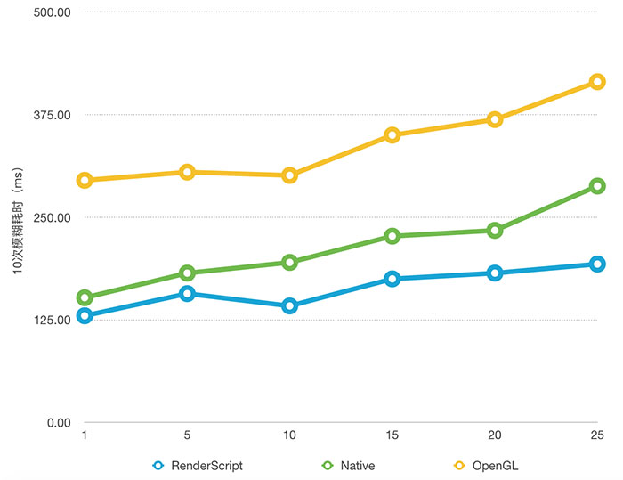

实际模糊性能受模糊半径选择影响较小，

### 4.4 内存占用
原图1000×600，缩放因子10，模糊核半径10。左为模糊10次，右为100次的内存占用情况。

- Java

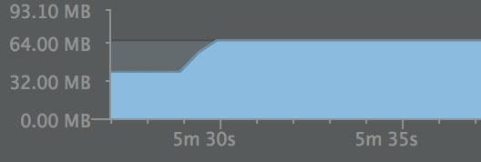


- Native

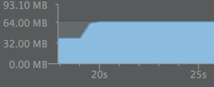
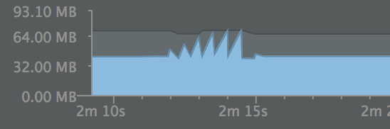

- RenderScript

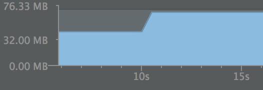
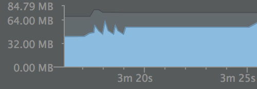

- OpenGL

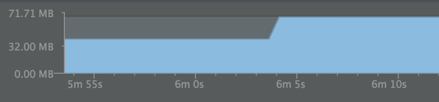
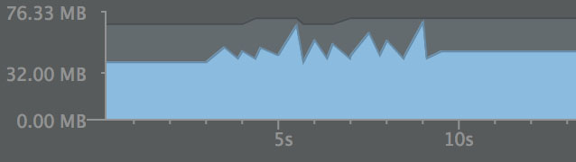

	处理小图片时，算法的内存占用差异不大。

原图1920×1080，缩放因子1，模糊核半径10。

- Java

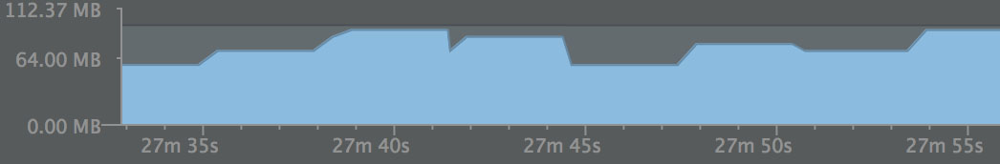

- Native

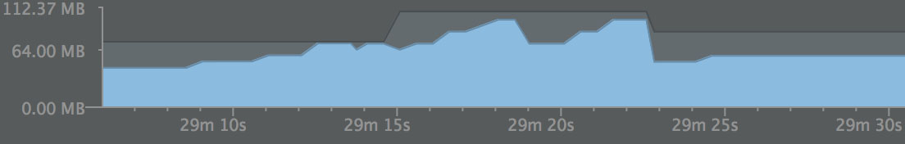

- RenderScript


- OpenGL

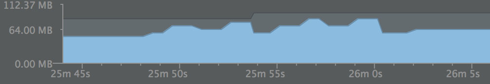

	当原图尺寸较大时，RenderScript具有更低的内存占用，

### 4.5 方案优缺点分析
1. Java和Native方案，与其他方案相比具有更好的兼容性，其中Native方案比Java方案模糊效率稍高一些，但总体而言，与RenderScript相比，运算耗时更久，且在低端机型环境下，更容易引起OOM；
2. RenderScript方案的优点在于相当可观的模糊效率，但部分机型系统尤其是低版本系统会出现兼容性问题，常见为librsjni.so和libRSSupportIO.so缺失引起的错误。（BuildToolsVersion为23.0.2时，在Android4.x版本上部分机型会出现，选择BuildToolsVersion为24或22正常）另外，对于高斯模糊，RenderScript在模糊半径大于25时会失效；
3. OpenGL方案的模糊效率相对低一些，当在使用高斯模糊，以及大尺寸图像时，采用该方案会比Native高效一些。缺点是GPU的寄存器相对有限，部分低端机型在模糊半径较大时，由于寄存器不足而渲染失败。还有一个需要注意的问题，一个应用程序进程可以上传的OpenGL纹理是有大小限制的。

### 4.6 方案优先级
1. 在实现图像模糊时，一般使用RenderScript方案实现高斯模糊即可解决问题，针对RenderScript有兼容性问题的机型，可以采用使用Native方案实现的Stack模糊。

2. 而针对一些低端机型，在RenderScript方案失效时，还是需要评估Native的效果，低端机应该慎重考虑是否应用模糊，毕竟模糊是一个运算量大且相对耗时的工作。
3. 对于模糊质量要求不高的场景，可以使用Box Blur替代Gaussian Blur，当然Stack Blur也是不错的选择。
4. 并不能就此说明OpenGL是一个较差的实现方案，因为这里是通过获得模糊的Bitmap来实现模糊效果的展示，OpenGL模糊图片的操作并不耗时，但像素提取操作GLES20.glReadPixels()并不高效，利用OpenGL实现模糊可以使用其他方式，比如直接TextureView上的渲染，或者GLES20Canvas(HardwareCanvas)或者DisplayListCanvas的渲染嵌入实现。
5. 实际模糊性能还和机型有关，在小米Note上，OpenGL的方案相对效率低一些，但是在美图M4上OpenGL方案明显好于Native。

## 五 动态模糊

一般而言，每秒30~60帧的帧率能给人流畅的感觉，实现动态模糊应该尽量满足30~60帧的要求。

### 5.1 动画
可以实现逐步模糊的动画。虽然前面OpenGL方案的数据没有完全满足30~60帧的要求，但实际感受仍比较流畅。这里原图1699*1080，并未做Resize处理。

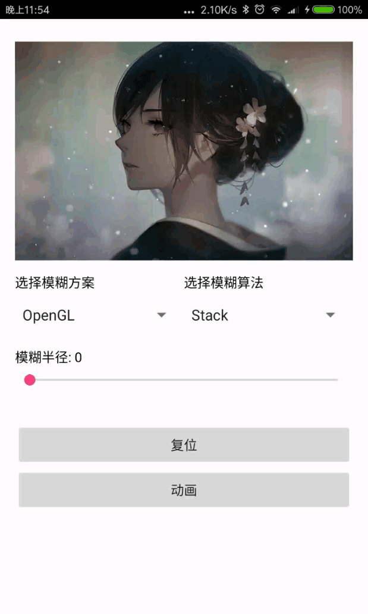

### 5.2 任意部位模糊

较高的模糊处理效率，可以实现任意部位的实时模糊。实际并不需要特别大尺寸的图只需要选取屏幕的一部分即可。

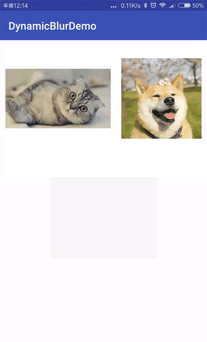

## 六 注意事项

### 6.1 OpenGL ES Context在多线程环境下的管理
OpenGL在多线程环境下工作需要额外的处理，为了正常工作需要遵守两条规则：

- 一个线程只能有一个渲染上下文（Render context）
- 一个context只能绑定一个线程

因此在多线程环境下的实现context共享的处理方式如下：

1. 将context与线程1绑定: ```eglMakeCurrent(display, surface, surface, context);```
2. 在线程1执行OpenGL操作…
3. 将context与线程1解绑: ```eglMakeCurrent(display, EGL_NO_SURFACE, EGL_NO_SURFACE, EGL_NO_CONTEXT);```
4. 将context与线程2绑定: ```eglMakeCurrent(display, surface, surface, context);```
5. 在线程2执行OpenGL操作…

### 6.2 最佳实践


1. Native方案实现时，需要注意内存的分配方式，直接使用数组存储像素容易造成OOM，建议malloc动态分配，同时别忘了及时释放。对于像素的操作一般采用short类型变量存储。
2. OpenGL方案中编写的shader代码需要注意临时变量的设置，

	```glsl
	for(int i = 0; i < KERNEL_SIZE; i++) {
		...
		vec2 offset = vec2(float(i - radius) * uWidthOffset, float(i - radius) * uHeightOffset);
	    sampleTex[i] = vec3(texture2D(uTexture, (vTexCoord.st + offset)));
		...
	}
	```
这里避免使用数组存储offset，offset是在每次循环中重新计算的，不要出现

	```glsl
	float offset[KERNEL_SIZE];
	for(int i = 0; i < KERNEL_SIZE; i++) {
		offset[i] = ...;
	}
	...
	```
这样的写法，此外，模糊核权重也应该实时计算获得，而不是提前存储于数组。这是由于GPU寄存器资源本身有限，且随着模糊半径增加，offset数组尺寸提高，需要更多寄存器，当半径增大到一定值时，渲染将失败（亲测使用数组，模糊半径只能取到10，而计算的方式增大到25+仍没有问题）。
3. 增大半径仍然不能满足模糊度需求时，不如考虑2次模糊;
4. targetSdkVersion不要用高版本编译的程序运行到低版本系统上（亲测targetSdkVersion = 23在4.4系统上无法跑RenderScript)

## 七 使用姿势

已将上述方案整理成组件，使用姿势如下：

```java
Blur.with(context)
    .scheme(Blur.SCHEME_RENDER_SCRIPT) //设置模糊方案
    .mode(Blur.MODE_GAUSSIAN) //设置模糊算法类型
    .sampleFactor(10) //设置缩放因子
    .radius(10) //设置模糊半径
    .getBlurGenerator() //获得模糊实现类
    .doBlur(bitmap); 	//模糊图片

```
doBlur返回模糊后的Bitmap。
详情可以参考Demo：
[https://github.com/yuxfzju/DynamicBlur](https://github.com/yuxfzju/DynamicBlur)


## TODO
1. 实际测试可以发现，模糊图像尺寸upscale为原图尺寸，还是占用了一定的耗时，进一步优化效率可以从这方面入手；
2. OpenGL方案中GLES20.glReadPixels()效率太低，可以考虑两种解决方案：
	- 对于支持OpenGL ES 3.0的Android 4.3以上系统，可以使用Pixel Buffer Object获取像素值；
	- Android 4.3以下系统，则采用EGL_KHR_image_base的解决方案。

## 参考
1. [http://malideveloper.arm.com/resources/sample-code/thread-synchronization/](http://malideveloper.arm.com/resources/sample-code/thread-synchronization/)
2. [http://blog.ivank.net/fastest-gaussian-blur.html](http://blog.ivank.net/fastest-gaussian-blur.html)
3. [http://blog.iangclifton.com/2011/08/24/renderscript-101-part-1-renderscript-basics-tutorial/](http://blog.iangclifton.com/2011/08/24/renderscript-101-part-1-renderscript-basics-tutorial/)
4. [http://www.learnopengles.com/android-lesson-one-getting-started/](http://www.learnopengles.com/android-lesson-one-getting-started/)

